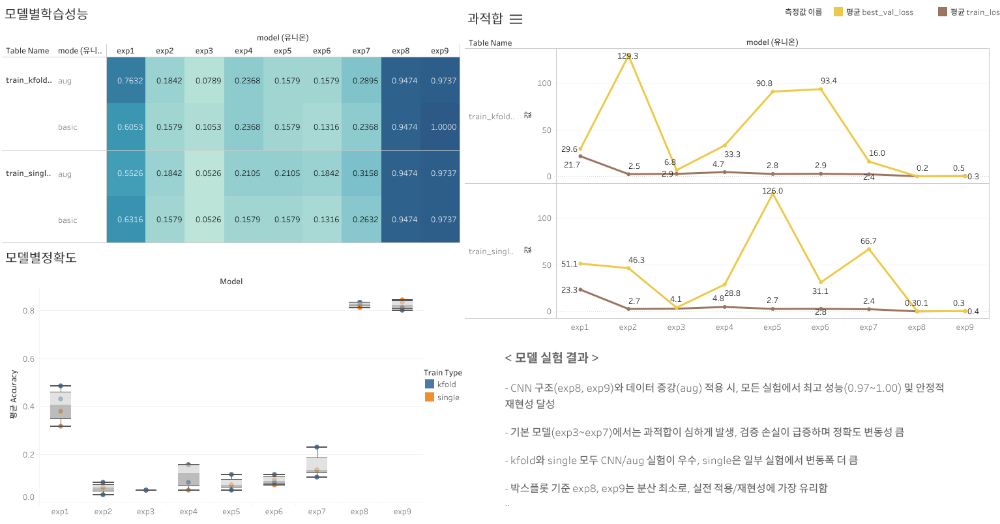

# 🧠 Sign Classification Project

손글씨 이미지를 분류하는 MLP 및 CNN 기반 모델 프로젝트입니다.  
총 9개의 실험 모델을 구현했으며, 단일 학습, K-Fold 교차 검증, 모델 추론 기능을 포함합니다.

---

## 폴더 구조

```
.
├── data/
│   ├── train/                # 학습 이미지
│   └── test/                 # 테스트 이미지
├── models/                   # 학습된 모델 (.h5)
├── logs/                     # 학습/검증 로그
├── outputs/                  # 추론 결과(csv)
├── src/
│   ├── preprocessing.py      # 이미지 전처리
│   ├── preprocessing_aug.py  # 증강 처리 (옵션)
│   └── model.py              # 모델 정의 
├── train_single.py           # 단일 학습 실행
├── train_kfold.py            # K-Fold 학습 실행
├── inference.py              # 추론 실행
├── graph.twb                 # Tableau 대시보드 파일
└── README.md

```

---

## 설치 및 실행

### 1. 학습 데이터 준비

* `./data/train` 및 `./data/test` 디렉토리에 `.png` 또는 `.jpg` 이미지 배치
* 파일명 예시: `sign_3_001.png` → 라벨은 파일명에서 자동 추출됨

### 2. 단일 모델 학습 실행

```bash
python train_single.py
```

### 3. K-Fold 교체 검정 실행

```bash
python train_kfold.py
```

### 4. 모델 추론 실행

```bash
python inference.py
```

---

## 실험 모델 목록 (9가지)

## 🧩 실험 모델 및 최종 추론 결과

| 모델 | 구조                        | Mode   | 학습유형   | 테스트 정확도 (Test Accuracy) |
|------|-----------------------------|--------|----------|-----------------------------|
| exp1 | 2048 + L2                   | aug    | kfold    | 0.4842                      |
| exp2 | 2048 → 1024                 | basic  | kfold    | 0.0842                      |
| exp3 | 64 → 16                     | basic  | single   | 0.0526                      |
| exp4 | 128 + L2 → 64               | basic  | kfold    | 0.1578                      |
| exp5 | 512 + Dropout → 256         | basic  | kfold    | 0.1157                      |
| exp6 | 256 → 128 + Dropout -> 64   | basic  | kfold    | 0.1157                      |
| exp7 | 2048 + Dropout              | aug    | kfold    | 0.2315                      |
| exp8 | CNN(32-64-128), D=0.3       | basic  | kfold    | 0.8315                      |
| exp9 | CNN(32-64-128), D=0.4       | basic  | single   | 0.8421                      |


---

## 결과 파일

* `logs/train_single_log.csv`: 단일 학습 로그
* `logs/train_kfold_log.csv`: 교체 검정 정확도 로그
* `outputs/inference_result.csv`: 테스트 예측 결과 저장

---

## 📑 실험 결과 요약

- **CNN 모델(exp8, exp9)**  
  → 모든 실험에서 **최고 성능 정확도 및 안정적 재현성** 달성

- **기본 MLP(특히 exp3~exp7)**  
  → 과적합 및 변동성 심함, **검증 손실 급증** 경향

- **K-Fold / Single**  
  → 둘 다 CNN이 우수하며, single에서는 일부 변동폭 큼

- **과적합 지표 및 상세 결과**  
  → `inference_accuracy.csv`, `logs/` 내 학습 로그 참고
---

## 사용 기술

* Python 
* TensorFlow 
* scikit-learn
* pandas, numpy, PIL
* Tableau (시각화)

---

## 📈 시각화 대시보드
 [](https://public.tableau.com/views/graph_17534447134700/1?:language=ko-KR&publish=yes&:sid=&:redirect=auth&:display_count=n&:origin=viz_share_link)

- 주요 지표:
  - 모델별 학습 성능
  - 모델별 과적합 판단
  - 모델별 정확도
  - [대시보드 다운로드: graph.twb](./graph.twb)
  